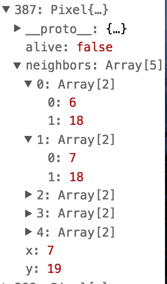
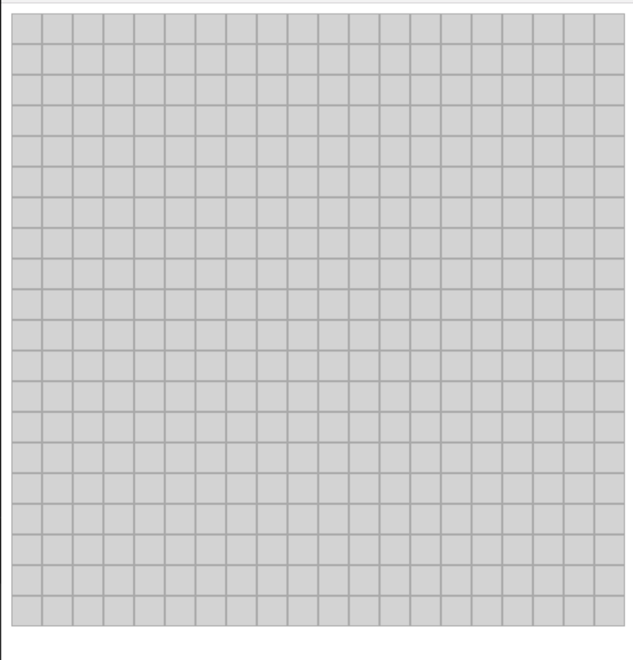

Creating life, well cellular automata is really what we did here. Conway’s game of life runs on a rather simple set of rules that simulates life.

-   If you’re alive and have 4 or more neighbors, you die from famine.
-   If you’re alive and have fewer than two relatives you die from loosing your mind and from being isolated.
-   If you’re alive and have 2 or 3 neighbors you’ll live.
-   If you’re dead and have three neighbors you’ll be reborn.

Four rules govern the whole thing. Implementing the thing is a bit difficult. I paired with another member from the recurse center on this project. The debt on the application design and implementing the functionality was great. I highly recommend working with another person on this project. You’ll both help each other think and not get stuck down rabbit holes. That and teamwork is cool and stuff.

Our first step was building a board of pixels for the game to be built on when the page loaded. So we pushed a pixel object with x, y, size, alive values and a neighbors array on to state. Yes, we did this as a one dimensional array.

Here’s a screen grab of our state.



We then passed our pixels down to our board. Our board took our pixels and we used map to iterate over each one and put it on the screen with it’s object value passed onto the pixel.



After getting the pixels on the board the next logical step in the build was to add the functionality of clicking a pixel and having it change color. This wasn’t too hairy. We passed a toggle method down to our component which switched state of the pixel from dead to alive. This function took an x and y coordinate so that the function could target the correct pixel to update state on. Actually since we used a one dimensional array we had to do a little more calculation which we might want to optimize in the future to update the pixel. Instead of just using the x and y values we had to calculate the total value of the pixel to find it in the array.

```
pixels[position.y*size + position.x].alive = !pixels[position.y*size + position.x].alive;

```

Next came getting the board to iterate. We took advantage of Javascript’s setInterval function which called or function to evolve every amount of seconds specified by speed.

Warning: the next section of the code is where we get into the meat and potatoes of the logic in the application.

We need to make a copy of the old pixels, and the pixels that are going to be changed. We don’t want to change pixels based off a looping change of a neighbor. They should all have a generation increment at the same time! 

So, we loop through all pixels, then we check each pixels old generation neighbors and get their alive or death value. I also forgot to mention we created a helper function to gather neighbor pixels around it. Next. we reduce and get a count on the amount of live or dead neighbors around the pixel. We apply the rule if neighbors alive is either 2 or 3 keep the pixel alive if it’s not them kill the pixel :(.

That for the most part gets the core functionality working. Now, theres a bunch of other detail that’s been omitted because I don’t want to write a book. The next steps were creating the UI and controls which manipulate the board. To be perfectly honest they’re your standard react passing down of components and changing state patterns. We updated the size of the pixels to fit in container for a kind of zoom effect. We also converted seconds into milliseconds.

Some other interesting things we discovered during this project was that in our case calling setState was rather expensive, especially since we called it so dang much.

That’s basically it! Check out the game on github [here](https://github.com/benschac/25-react-projects/tree/master/game-of-life).
