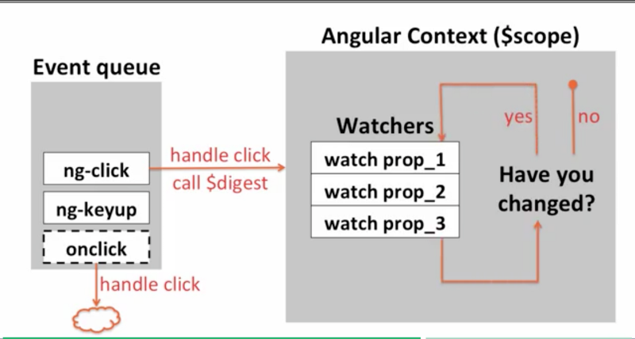

  

Welcome! I’m not going to lie. This post is going to have a lot of meat and potatoes to it. There was a lot of content in this week. There was also a lot new content so it’s best to listen, do and write to really get the concepts to stick into that old noggin of mine. 

Let’s start with a subject that’s a little more friendly. I’m talking about [filters](https://docs.angularjs.org/api/ng/filter/filter). Filters are neat-o and magic. With about 1 line of code you can create a search that looks for user input in realtime, convert currency, time, dates, you name it. Here’s a complete listing of angular’s built in f[ilters](https://docs.angularjs.org/api/ng/filter).

But, angular doesn’t have all of the answers. What if there’s a filter that you want that angular doesn’t have? Well, lets talk about custom filters.

### Creating Custom Filters

_Step 1:_ Create a factory function! (Don’t worry, factory functions are functions that create new objects or functions). (Side Note: [Medium](https://medium.com/u/504c7870fdb6)’s code formatter is awful so all of my code is going to be in a gist at the bottom of this section)

This code snippet takes in input and returns a function that changes it in some form.

_Step 2:_ Register your custom filter in your angular module. This way your application is going to have access to the custom filter you’ve just created.

_Step 3 (This is the tricky one):_ Inject the filter into your controller. While actually doing it isn’t that bad. There’s a little background that’s super helpful to understand. I’m injecting the custom filter as customFilter. This is no accident. If I just used custom I’d be injecting the factory function that was defined and not the filter that it returns. So, angular does a little magic behind the scenes to take care of that for us by simply adding a Filter to the end of our named factories. Just a note, you probably don’t want to name a custom filter something like coolFilter because you’ll have to inject it as coolFilterFilter.

(Note: Injection in angular is used to protect named variables from **Minification.** Here’s a little more on [minification](https://scotch.io/tutorials/declaring-angularjs-modules-for-minification) if you’re interested)

So that’s it. Three simple steps and BAM! You too can write a super cool filter that does some neat stuff. What’s also great about filters is that you can use then in your interpolations in your html and add additional arguments for your filter as well.

I really hope I’ve sold you on filters at this point. Seriously folks, go make one.

### The Digest Cycle, Watchers.

So how does all of this work, you know angular, directives and the flashy data binding? Well, let me tell you about the digest cycle and watchers.

Let’s say we use an ng-click directive in our code. Angular has it’s own event queue (just a side note, if you use an onclick event handler angular isn’t going to regester it in the digest cycle.)

After we trigger the ng-click directive the $digest method is called (another side note, when you see a $ in front of a method it’s a built in angular method so don’t name your directives, controllers, well anything with a $) which checks watchers in angular’s context. If no watcher has changed angular runs once. If there’s a change angular’s $digest checks twice. Once to detect the change and the second to check that the change was made. This is called **dirty checking**.

You can set up a watcher a couple of different ways. They’re interpolation, calling the $watch method on angular’s scope or setting up an input field with two-way data binding.

If you want to trigger the digest cycle manually check out angular’s [$digest() function](https://docs.angularjs.org/api/ng/type/$rootScope.Scope#$digest).

Additionally there’s a [$apply() function](https://docs.angularjs.org/api/ng/type/$rootScope.Scope#$apply) which can add a function to angular’s scope. Let’s say you actually wanted to use javascript’s native onClick method. You’d call it with apply.

### **Data Binding**

Is also pretty sweet. There’s a few different way’s one can bind data in angular.js 1.5.x. 2-way and 1-way. They’re different. Most of the time, you’ll want to use a 1-way data binding. Watching for data bi-directionally takes, well more watchers. More watchers take more resources and make your site slower. While typing something into a form field and watching it print out immediately is pretty cool, you’re not going to have to do it that much.

  

1-way data binding only checks if the data has changed on the viewmodel level. Components by default are set to a one-way binding.

### Controller as Syntax and why it’s so gosh darn important

Services, Factories and Providers
