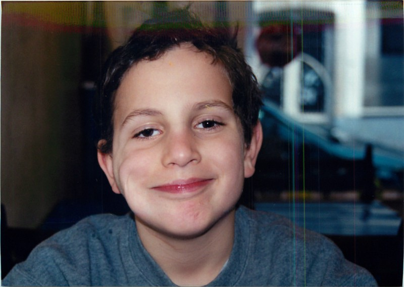
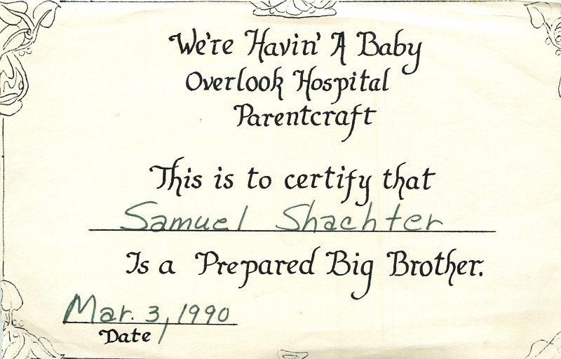

This post is inspired by a short talk I was lucky enough to give at the Facial Paralysis conference at SickKids hospital in Toronto.

> The greatest glory in living lies not in never falling, but in rising every time we fall.

> \- Nelson Mandela

Everyone has their shortcomings, some battle they’re fighting. I was lucky, mine is literally on my face. It’s the first thing you’ll see when you meet me. When I’m smiling, it’s more obvious. This for most of my life this was a bug, not a feature.

I have partial facial paralysis on the right side of my face.

**Having a positive attitude and living life is facing adversity. **

**Living well is the best revenge.**

Until recently, I haven’t thought about how it’s shaped the lives of those around me. How talking about this journey can help others who struggle with their body image too.

Reflecting on the experiences of others along this journey has been humbling and productive. Friends and family were kind when I needed it most. At times when it was particularly challenging for them. The person who received this certification especially. Thank You, [Sam](https://medium.com/u/7427ec929f33).

### How Can We Move The Needle Forward In A Positive Direction?

What is a positive direction?

 For me, it was understanding what failure (TODO: link other blog post) was and taking action, quickly and iteratively. Measuring if success was closer or farther away. While success can’t always be quantified, being self-aware has been a helpful tool in bettering myself.

Just knowing there was a needle that needed to be moved was a major step forward to facing adversity.

**What’s a positive direction for you?**

**How do you get to where you want to go?**

Comment — We’d love to hear from you.

### Body Dysmorphia

I’d spend hours in front of the mirror imagining what I’d look like without facial paralysis. Staring at the side that wasn’t damaged. What could have been. Why’d did it have to happen to me?

There wasn’t anyone else around me who had what I had. 

The worst part was when my neuritic Jewish parents would tell me that I was “handsome”. The one that stung the most was, “you wouldn’t even know”.

Being self-aware and knowing that:

-   You’re upsetting yourself.
-   Other people feel the same way. Many folks struggle with the same feelings you are and that you’re not the only one.

was critical to changing mental state to a positive one.

### Learning To Smile

It’s a thing. It’s an important thing. Both mentally and physically it was something that didn’t come naturally. 

### Getting To A PMA (Positive Mental Attitude)

Positive change is difficult. Everyone would do it if it was easy. It wouldn’t be adversity if it wasn’t hard. Yes, I would love a parade every time a picked my nose too. That’s kinda the point.

I can’t is an order of magnitude easier than I can. Just do it is easy on paper but very hard to execute. 

It’s really hard, it takes work every single day. PMA doesn’t come easy.
