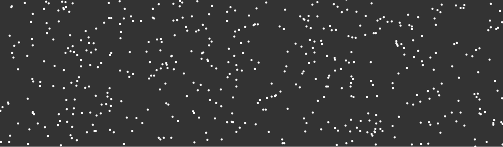

  

Yesterday I paired with a friend from the Recurse Center! We made a thing! Both of us knew nothing about p5.js, we found a [tutorial](https://www.youtube.com/watch?v=4hA7G3gup-4) and then added on to it. Here’s what the final product looks like. We learned about steering, force behaviors and a couple of nifty p5.js methods. We decided to put our own little twist on it which was a word change on click. This feature actually worked out really well at the end of the day because we used our presentation as a slide show. Two birds, one stone.

Let’s talk about the tutorial first. P5 has two core functions that all art needs. A setup (which is kinda self explanatory) and draw which loops at about 60 fps which drives the animations.

We’re able to get the lines from each path in the text with a built in method in p5, I won’t bore you with that stuff.

Each dot is created as a vehicle object with a couple of different properties. It takes x and y coordinates, but it also has a target value, velocity and maximum speed and maximum force instance variables too.

The neat part of this whole thing is the steering functionality algorithm. For more about Steering check out [Craig Reynolds](http://www.red3d.com/cwr/steer/) paper on steering. Steering in a nutshell is basically: TBD, write about this and fill it in.

The other interesting part of this is the fleeing functionality when you hover over a piece of text.

Our addition to this tutorial was the ability to update words on click.
