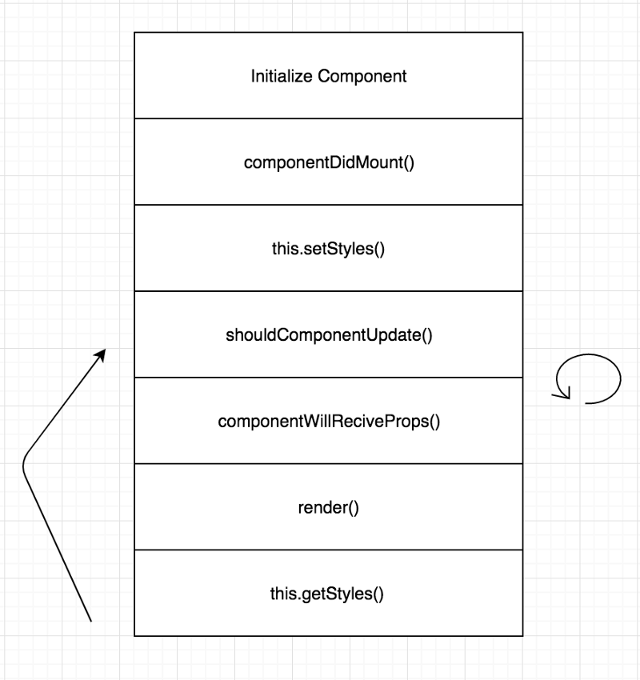

A big thanks to [Dexter](https://medium.com/u/10e7d71b6655) engineering specifically [Daniel Ilkovich](https://medium.com/u/5509cf8da295) and [David Hu](https://medium.com/u/41dac176c234) for letting me share this code and all of their help and support while building the user tutorial feature on our [site](http://rundexter.com).

While React has ways to break the hatch and directly manipulate the DOM there are very few reasons to do this. We shouldn’t directly manipulate the DOM unless we have a really good reason to. When we need to we should use the `ref` property. Only as a last resort should we manipulate the DOM directly as well as change state during a render.

### The Problem

The grid snaps at 1024px from a fixed to a fluid grid. We wanted our tutorial tips to be 20px away from their parent element and there wasn’t a way to do this with just css. If the tip was positioned correctly in the fixed grid it would be off when the grid snapped to a fluid view.

The tutorial metadata is applied directly in inline styles of the component which has the highest css specificity. This meant that media queries couldn’t solve this problem because media queries would be overridden by css with higher specificity.

### The Solution

The solution needed to be a single set of metadata and a component that knew where it was so it could change its positioning on the fly. Here’s a video of the final component styles changing.

and the component moving with the viewport resize.

### Element.getClientRects()

First things first, we need to know where the parent element is on the page before we can do anything with it. The `.getClientRects()` [method](https://developer.mozilla.org/en-US/docs/Web/API/Element/getBoundingClientRect) does just that. If you query an element on the DOM and call `.getClientRects()` it’ll return an object of values with the position, height and width of that element in relation to the viewport of the browser. Give it a try on your end.

### Using a Stateful Component to store positioning

We need the component to know where it is at all times. Thinking about that requirement we need a `class` component that can hold its own state, not a stateless functional component. This is because the user can shrink or expand their viewport past or less than the 1024px threshold which changes our grid to fluid or fixed position. The component needs to be aware of viewport size so it can hold on to its dynamically generated positioning any time the screen size changes.

### Getters and Setters

The component has two core functions around dynamic positioning. Setting styles dynamically in relation to where the parent element is on the screen and getting those set styles to render the position of the tip. We’ve named these function methods `getStyles` and `setStyles`.

In this particular use cases we load in `tutorialMeta` JSON data for each tutorial tip and `setState` accordingly for each tip positioning type. **Note:** This isn’t a requirement for a self positioning component itself. Just information for the tutorial. Examples are instruction text and offset positioning so the tip is 20px away from it’s parent element and centered.

Now, it’s time to take this functionality and hook it into React’s lifecycle methods so the component know’s when to update its own positioning.

### Connecting to React’s Life Cycle Methods

Let’s hook up our getters and setters so our component knows when to fire them and update its props and state.

Initialization and Destruction:

On component load we need to `setStyles` since we currently don’t have any styles to get! Remember, the component is going to call `.getClientRect()` which is going to dynamically set positioning values. Additionally, we don’t want to query the DOM every time we resize the viewport.

We check if our props or state has changed. `shouldComponentUpdate`'s default is to return true if any state changed per React’s [docs](https://facebook.github.io/react/docs/react-component.html#shouldcomponentupdate). Since we’re also getting data from our container component as props we also need to check for props updates. **Note:** There is global dispatch and data for the entire tutorial like `nextStep` and `currentStep` this isn’t a requirement for every use case, just the one that we we’re solving for.

Next up `componentWillRecieveProps` is fired before a mounted component receives new props ([docs](https://facebook.github.io/react/docs/react-component.html#componentwillreceiveprops)). Using `replaceState` rather than `setState` blows away state and sets the component to not show. This is also for a very specific and deliberate for our use case, the flickering problem.

### There was a flickering problem

The dreaded flicker! It was ever so subtle, but it made our team twitch. There was a flash on initial load and when transitioning the tutorial tip it would hangout just one render step before where it was supposed to be.

**The Flash Flicker:** That’s where the `-9999` position came in. If there’s no positioning to give our component just make sure it’s off the page entirely.

**The Hanging Flicker:** Every time we get new props the component sets our display to false removing the component from the DOM entirely during transitions. If you look in `componentWillRecieveProps` , `setStyles` and `getStyles` you’ll see reference to how the component is removed and added with `display` set to false or true.

### The Render

This is the function that’s going to get our dynamically generated styles which is called in the styles `props`. **Note:** `_.getClassNameFromObject` is our own custom function that’ll create a string which we can add to a component class styles. We’re not going to dig into this function because it’s out of scope of the post. But, if you’re interested please leave a comment on the bottom of the post and I’ll try and answer your questions.

Here’s a diagram of our component lifecycle, getters, setters and render methods.

### The Entire Component

### But wait there’s more!

We also came up with an interesting solution to avoid adding components all over our application. This is useful if you need to add a series of components to your application like a tutorial.

In `setStyles` we query the DOM for a specific step rather than include the component multiple times. The container component renders the component once, then on each step change we look for a different step class to render the tutorial component.

### That’s all folks

Hopefully this helps anyone how might need this type of dynamic positioning functionality in their React application.
