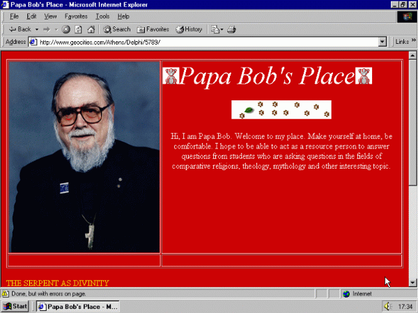
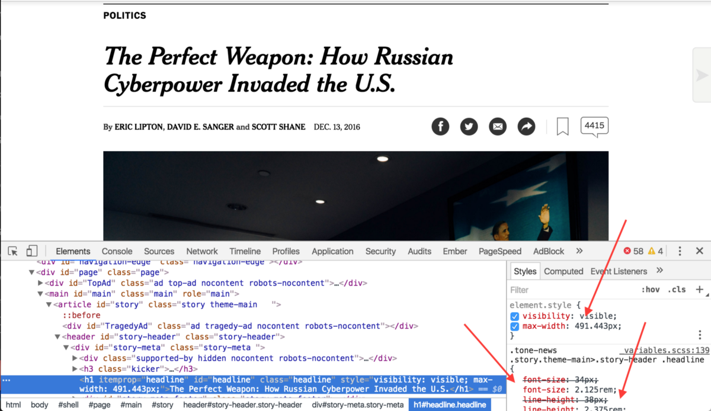
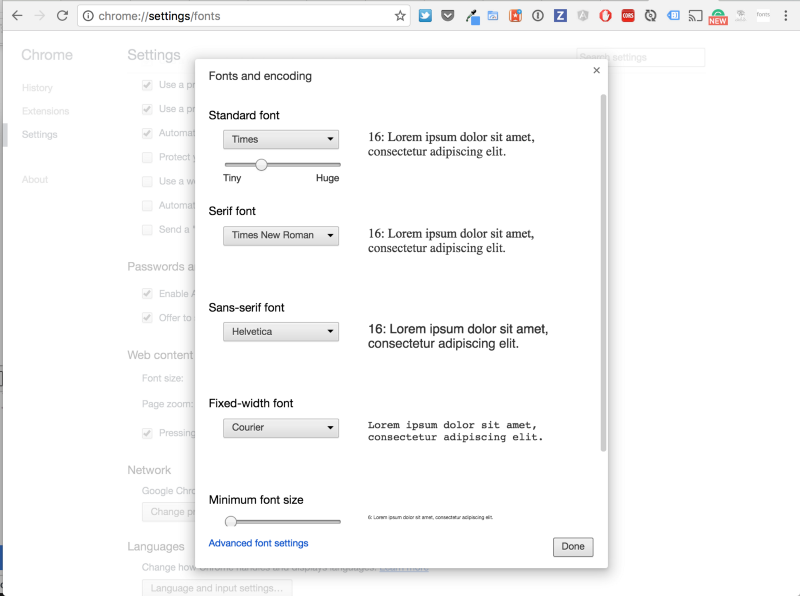
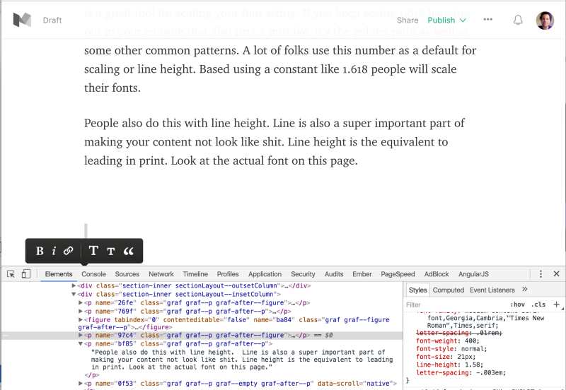

  

Pretty things on the internet. We all want to make them. Yet, it’s not so easy. There’s not a right or wrong. It’s pretty subjective in the eye’s of the beholder. Yet, we can all agree that we don’t want our sites looking like Papa Bob’s Place.

**Note:** Folks dedicate their entire professional careers to web design, typography, branding. I’m totally not summing up the complexity and skills need to do those jobs in like 1,500 words.

So, first things first. How do we make things that don’t look like shit? Good question! I don’t really know. But, I tried making my [personal site](http://benjaminschachter.com) not look like shit and it think I learned a couple of things.

### Typography

It all starts here. This is the tool that’s the connective tissue between your content and the reader. If your content is hard to read your users probably won’t read it. That’s the point. You want people to read your content.

### To-do Research Picking Fonts

Content to research.

### Size, spacing, line height

I spent a bit of time looking at sites that I enjoy reading content on, [Medium](https://medium.com/u/504c7870fdb6), digg.com, [Google News Lab](https://medium.com/u/f226348241d4), nyt.com. They all basically have the same things in common. The content is super easy to start reading. For the most part they use a similar consistent pattern.

Font-size isn’t just randomly picked (even if it might seem that way). There’s a system. People take a lot of time thinking about this stuff. If I was trying to make money based off what folks read on my site I would too.

So I dug a little deeper. Turns out there a rhyme to this rhythm to all of this (you’ll see what I did here, heh).

It all starts with the base size of your font. You can take a look in your browser settings to see yours (click the top right corner three dots, settings, advanced settings) and your should see something like this.

From your base sizing you’ll then be able to scale your font accordingly. This is a [great tool](http://type-scale.com/) for scaling your font sizing. If you keep seeing 1.618 hanging out in your console that also isn’t a mistake, it’s the [golden ratio](https://en.wikipedia.org/wiki/Golden_ratio) as well as some other common patterns. A lot of folks use this number as a default for scaling or line height. Based using a constant like 1.618 people will scale their fonts.

People also do this with line height. Line height is also a super important part of making your content not look like shit. Line height is the equivalent to [leading in print](https://en.wikipedia.org/wiki/Leading). Look at the actual font on this page.

  

  

Open the developer console (command + option + i) on a Mac and remove that line height. This article just got a whole lot harder to read. Same goes for your fonts, font sizing and well anything else related to typography.

You can scale up your fonts by 1.618 or make your line heights 1.618. You can calculate out your margins using a number related to 1.618. This creates consistency and a particular rhythem
