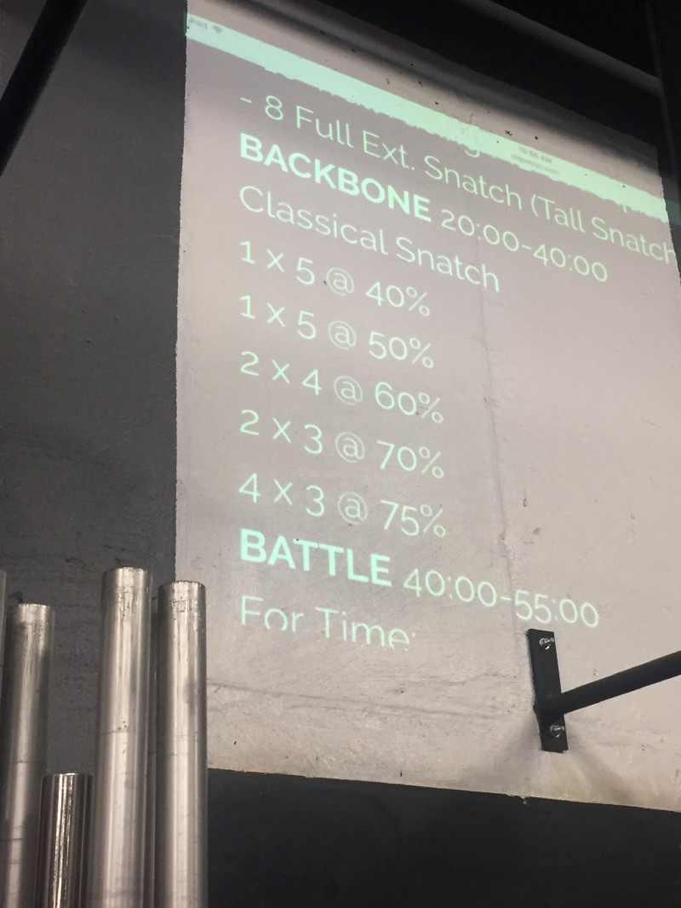
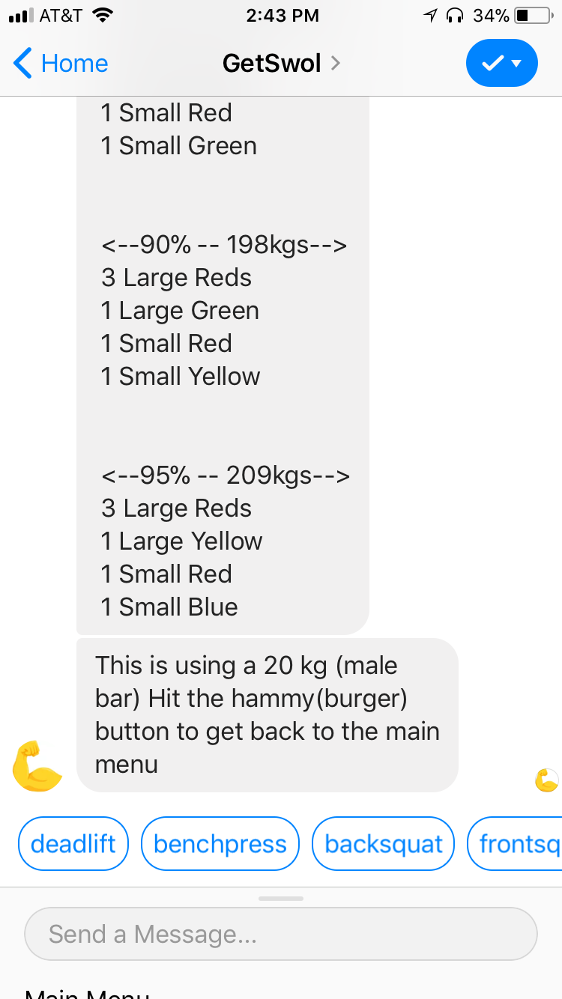

[GetSwol](https://www.facebook.com/getSwolBot/) is your fitness buddy. It’ll remember your maximum lifts and crunch what plates you need to put on for a percent of your maximum lift.

Crush your lifts, we’ll do the Math.

 Honestly, you even lift, bruh?

#### This is the problem

  

### Solution

#### While lifting heavy weights with a technical form I need to:

-   Remember my maximum lift for a specific type of lift.
-   Multiply by the percent of the maximum lift.
-   Know what the bar weight is and subtract it.
-   Divide by two.
-   Figure out which plate configuration to put on the barbell.

That’s 5 operations, for 5 lifts while pushing your body pretty darn hard. This sounds like a job for a Chatbot.

Additionally, we use Kilograms even though we’re in ‘Mercia. So, if you know your lifts in pounds, that’s another thing you have to worry about!

### Why a Chatbot?

I’m in NYC. I go to [CrossFit Spot](http://www.cfspotnyc.com). It’s in a basement with a poor cell signal. The 2 other gyms I went to also weren’t great in the cell signal department. A text-based solution that I don’t have to download yet another app for, perfect!

### RunDexter + JavaScript = ChatBots

I used [Dexter](http://rundexter.com) to build my bot. Full disclosure, I used to work at Dexter. To build a bot you need to use [RiveScript](https://rivescript.com). It’s pretty user-friendly. I know JavaScript thanks to [freeCodeCamp](http://freeCodeCamp.org). I can deploy to Facebook pretty quickly. Like one click quickly. You’re out the gate pretty quick.

### JavaScript

To use JavaScript with Dexter you need to use a [macro](http://docs.rundexter.com/writing/advanced/javascript/). I found myself writing the same variables over and over again so I made some boilerplate.

### Mocking A User

You’ll see a `mockuser.js` import in there. I needed a way to get `rs` methods into my local workflow when writing my functions in my text editor.

### Unit Testing With Jest

Just a simple `npm install --save-dev jest` and you’re good to go! There’s a bunch of functions here that have expected return values for specific inputs. I like to think of tests as infrastructure. Basically a canary in a coal mine. When a unit test breaks, you know where exactly and what the expected output should have been. God bless unit tests.

### Wrapping Up

Chatbots are h\*ckin awesome. They help deliver meaningful information in a quick, frictionless way. With a sprinkle of JavaScript, a splash of testing and a couple of mock functions with some dummy data, we’ll pump, you up!
