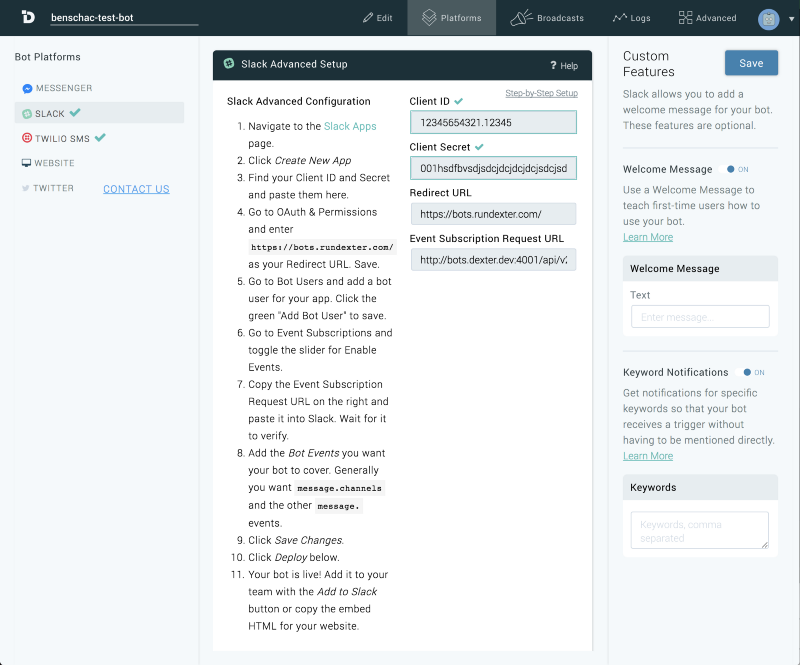

I’ve built [features](https://hackernoon.com/self-positioning-react-components-7e5d99e9349f) at work, but none started from scratch or had the level of technical complexity of this project. Initially I thought I’d be able to bang it out in a week. Just a couple of form fields, this should be cake! Famous last words. I learned a lot, made more mistakes than I can count and became a better developer in the process.

Here’s what I learned shipping my first ‘real’ feature.

### A little bit about the feature first

If your a bot creator on [Dexter](http://rundexter.com) you have a platform to create some pretty interesting bots. The feature I built added to our users ability to create custom bot features. On the platforms page right side bar you can now: 

For Messenger:

-   Enable custom message on your bot.
-   Enable and configure persistent menus.
-   Enable a greeting message + trigger.

For Slack:

-   Enable custom keyword triggers.
-   Enable a welcome message.

### If you have design comps, look at them, like a lot.

When building a visual product, the design comp is the closest thing you’ll get to a set of instructions of what you need to build. Question it. How the user is going to interact with that component? How you’re going to send your users information back? What’s going to happen if your user toggles a button? What if there’s an error? Is there client side validation? What are the conditions? Document where your data fits into the product in the design and specification. Use the design to help shape your data and how the component interacts with the data it’s receiving.

### Shape Your Data

After taking a really good look at your comps and thinking about how the entire thing works together start to shape the data that your interface is going to manipulate. Take that API response or schema that you have and see what needs to go where.

Really think this part though. This is going to be the format your application is going to work through. If it doesn’t make sense to you how it’s going to work, take another look at your comps. I can’t stress this enough. The entire feature is going to work off of this data structure. If something is conflated or difficult to understand, it’s going to make other parts of your application difficult to build down the road.

I’m not sure where the expression comes from but, `crap rolls down hill`. That’s certainly the case with bad systems design.

 I eventually had to go back, multiple times to fix issues that we’re caused by inconsistent data structures, multiple times. Usually, I had to change multiple parts of the application because the way the feature worked was dependent on the data structure.

By opening a blank file, going to through the comps and creating a couple of JavaScript objects I was able to structure the data a lot closer to what the final product looked like and see common patterns within my components and the API response I was consuming or sending requests to.

### Talk to your sever. It talks back.

Making sure that `http` requests that you’re sending are working ranks pretty high up on the list. Just getting some kind of success response is a win and a path forward. The entire component that I was working on revolved around the response it would receive from the server if you’re feature is working with a server. Without a solid grasp of what you’re getting back from the server I couldn’t really move forward. Maybe there’s something wrong with your API, you’ll never know if you don’t try to break it. Think about how you’d want each piece of data you get back from your server to connect to it’s visual representation. What if you don’t get data back from the server? What if your user gives you incomplete data?

### Stalk Your Data

Once I felt confident that my data structure represented my application I needed to needle the data through the feature. Usually, if I didn’t know how something worked it was because I didn’t understand how the data interacted with the UI of the component.

Taking the extra time to understand how my or walk away from your machine for five minutes and try again.

### How flexible is the design?

When your designing how your feature works, I also didn’t think very far into updating what I was building.

What if the product manager wanted `x` functionality in two weeks after we saw how users initially used the product. Or, if another developer needed to work on what I built? But, this comes back to designing your systems and data.
